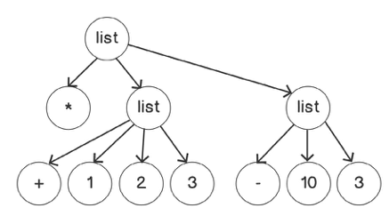

# Basics

Tree representation of:

```clojure
user=> (* (1 2 3) (- 10 3))
```



Evaluating this expression consists of reducing the tree, starting with the offshoots (the innermost lists):

**(\* (+ 1 2 3) (- 10 3))** becomes 

**(\* 6 7)** which becomes

**42**

**s-expressio**n is a data notation for writing data structures and code with lists.

```clojure
user=> 1 2 3
1
2
3
```

but

```clojure
user=> (1 2 3)
Execution error (ClassCastException) at user/eval11 (REPL:1).
java.lang.Long cannot be cast to clojure.lang.IFn
```

An exception was thrown because the first item of the list (the operator) was not a function.

There is a special syntax to prevent the list from being considered as the invocation of a function: the quote. Creating a literal list is done by adding a quotation **'**, in front of it:

```clojure
user=> '(1 2 3)
(1 2 3)
```

By preventing the evaluation of the form, we can now write a literal representation of lists.

"Code is data" is a famous saying in the Lisp world, and a powerful concept that allows your program to generate code (known as **meta-programming**).

## Special Forms

- **when**, which can be used when we are only interested in the case of a condition being *truthy* (a value is *truthy* when considered true in the context of a Boolean expression).
- **do**, which can be used to execute a series of expressions and return the value of the last expression.
- **def** and **let**, which are special forms that are used to create global and local bindings.
- **fn** and **defn**, which are special forms that are used to create functions.

e.g.

```clojure
user=> (if true "Yes" "No")
"Yes"
```

```clojure
user=> (do (* 3 4) (/ 8 4) (+ 1 1))
2
```

```clojure
user=> (when true (println "First") (println "Second") "Last")
First
Second
"Last"
```

## Bindings

In Clojure, we use the term *bindings* rather than *variables* and *assignments* because we tend to bind a value to a symbol only once.

You can use **def** to define global bindings and **let** for local bindings.

```clojure
user=> (def x 10)
#'user/x

user=> x
10
```

*When the REPL returns* **#'user/x***, it is returning a reference to the var you have just created. The user part indicates the namespace where the var is defined. The* **#'** *prefix is a way of quoting the var so that we see the symbol and not the value of the symbol.*

```clojure
user=> (let [y 3] (println y) (* 10 y))
3
30
```

**let** takes a "vector" as a parameter to create the local bindings, and then a series of expressions that will be evaluated like they are in a **do** block.

```clojure
user=> (let [x 10 y 20] (str "x is " x " and y is " y))
"x is 10 and y is 20"
```

## Create a Function

```clojure
user=> (fn [])
#object[user$eval170$fn__171 0x19553973 "user$eval170$fn__171@19553973"]

user=> (fn [x] (* x x))
#object[user$eval174$fn__175 0x32c8e539 "user$eval174$fn__175@32c8e539"]
```

Remember that, in Clojure, the first item of an expression will be invoked, so we can call our anonymous function by wrapping it with parentheses and providing an argument as the second item of the expression:

```clojure
user=> ((fn [x] (* x x)) 2)
4
```

```clojure
user=> (def square (fn [x] (* x x)))
#'user/square

user=> (square 2)
4
```

Or even better:

```clojure
user=> (defn square [x] (* x x))
#'user/square

user=> (square 10)
100
```

```clojure
user=> (defn meditate
         "Meditation given `s` and `calm`"
         [s calm]
         (println "Clojure Meditate v1.0")
         (if calm
           (clojure.string/capitalize s)
           (str (clojure.string/upper-case s) "!")))
#'user/meditate
```

```clojure
user=> (meditate "hello" true)
Clojure Meditate v1.0
"Hello"

user=> (meditate "hello" false)
Clojure Meditate v1.0
"HELLO!"
```

## True and False

```clojure
(if nil "Truthy" "Falsey")
=> "Falsey"

(if false "Truthy" "Falsey")
=> "Falsey"

(if 0 "Truthy" "Falsey")
=> "Truthy"

(if -1 "Truthy" "Falsey")
=> "Truthy"

(if '() "Truthy" "Falsey")
=> "Truthy"

(if [] "Truthy" "Falsey")
=> "Truthy"

(if "false" "Truthy" "Falsey")
=> "Truthy"

(if "" "Truthy" "Falsey")
=> "Truthy"
```

If we want to know whether something is exactly **true** or **false**, and not just **truthy** or **falsey**, we can use the **true?** and **false?** functions:

```clojure
(true? 1)
=> false

(if (true? 1) "Yes" "No")
=> "No"

(true? "true")
=> false

(true? true)
=> true

(false? nil)
=> false

(false? false)
=> true
```

Similarly, if we want to know that something is **nil** and not just **falsey**, we can use the **nil?** function:

```clojure
(nil? false)
=> false

(nil? nil)
=> true

(nil? (println "Hi"))
Hi
=> true
```

Remember that **println** returns **nil**, and so the last piece of output in the preceding code is **true**.

When all the values passed to **and** are *truthy*, **and** will return the last value:

```clojure
(and "Hi")
=> "Hi"

(and "Hi" "Then" "Bye")
=> "Bye"

(and false "Hi" "Bye")
=> false
```

Here, **and** evaluates the first expression, which prints **Hi** and returns **nil**, which is *falsey*. Therefore, the second expression is not evaluated, and **Bye** is not printed:

```clojure
(and (println "Hi") (println "Bye"))
Hi
=> nil
```

**or** works in a similar fashion: it will return the first *truthy* value that it comes across and it will not evaluate the rest of the expression when that is the case. When all the values that are passed to **or** are *falsey*, **or** will return the last value.

```clojure
(or "Hi")
=> "Hi"

(or "Hi" "Then" "Bye")
=> "Hi"

(or false "Then" "Bye")
=> "Then"
```

and here:

```clojure
(or true (println "Hi"))
=> true
```

**or** evaluated the first expression **true** and returned it. Therefore, the second expression was not evaluated, and **Hi** was not printed.

You can pass multiple arguments to the **=** operator:

```clojure
(= 1 2)
=> false

(= 1 1 1)
=> true

(= 1 1 -1)
=> false
```

```bash
(= nil nil)
=> true

(= false nil)
=> false

(= "hello" "hello" (clojure.string/reverse "olleh"))
=> true

(= [1 2 3] [1 2 3])
=> true
```

*In Java or other object-oriented programming languages, comparing things usually checks whether they are the exact same instance of an object stored in memory, that is, their identity.* In Clojure you could do so by using the **identical?** *function.*

Surprisingly sequences of different types can be considered equal as well:

```clojure
(= '(1 2 3) [1 2 3])
=> true
```

You can view the comparion operators as checking order:

```clojure
(< 1 2)
=> true

(< 1 10 100 1000)
=> true

(< 1 10 10 100)
=> false

(<= 1 10 10 100)
=> true

(> 3 2 2)
=> false

(>= 3 2 2)
=> true
```

and there's **not**:

```clojure
(not true)
=> false

(not nil)
=> true

(not (< 1 2))
=> false

(not (= 1 1))
=> false
```

How does all this compare to a more traditional language such as JavaScript:

```javascript
let x = 50;

if (x >= 1 && x <= 100 || x % 100 == 0) {
  console.log("Valid");
} else {
  console.log("Invalid");
}
```

```clojure
(let [x 50]
  (if (or (<= 1 x 100) (= 0 (mod x 100)))
    (println "Valid")
    (println "Invalid")))
```

The JavaScript version could be reduced but new syntax is required e.g. an "inline if" using **?** and ***** whereas Clojure can be reduced without any syntax changes e.g.

```clojure
(let [x 50]
  (println (if (or (<= 1 x 100) (= 0 (mod x 100))) "Valid" "Invalid")))
```

