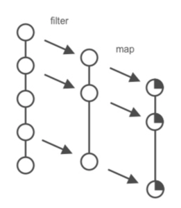

# Mapping & Filtering



```clojure
(map inc [1 2 3])
=> (2 3 4)
```

```clojure
(filter keyword? ["a" :b "c" :d "e" :f "g"])
=> (:b :d :f)
```

Function **filter** applies a **predicate function** to "pass through" elements, whereas **remove** does the opposite:

```clojure
(filter odd? [1 2 3 4 5])
=> (1 3 5)

(remove odd? [1 2 3 4 5])
=> (2 4)
```

```clojure
(take 3 [1 2 3 4 5])
=> (1 2 3)

(drop 3 [1 2 3 4 5])
=> (4 5)
```

```clojure
(take-while #(> 10 %) [2 9 4 12 3 99 1])
=> (2 9 4)

(drop-while #(> 10 %) [2 9 4 12 3 99 1])
=> (12 3 99 1)
```

## Threading Macro

Of course we can combine the likes of **filter** and **map**:

```clojure
(map (fn [n] (* 10 n)) (filter odd? [1 2 3 4 5]))
=> (10 30 50)
```

For some this can be a tad hard to follow because **filter** is first applied and then **map**.

Alternatively, and much more idiomatically, we can use Clojure's **threading macros**:

```clojure
(->> [1 2 3 4 5]
     (filter odd?)
     (map (fn [n] (* 10 n))))
=> (10 30 50)
```

*A macro is a construct that transforms code before it is executed.*

*You can think of Clojure's threading macros as "syntactic sugar" that allows us to write more readable code by avoiding deep nesting.*

## Lazy Sequence

The following are equivalent:

```clojure
[1 2 3 4 5]
=> [1 2 3 4 5]

(range 1 6)
=> (1 2 3 4 5)
```

So, is this just a shortcut to avoid typing out lots of integers? Well, it is, but **range** has another interesting characteristic: it's **lazy**.

*The REPL causes lazy sequences to be evaluated. This can be confusing sometimes if the problem you are debugging is caused by a lazy sequence not being fully evaluated: "This code works just fine in the REPL; why doesn't it work correctly in my code?" When debugging in the REPL, if you want to avoid forcing the evaluation of a lazy sequence, assign it to a variable instead.* E.g.

```clojure
(def our-seq (range 100))
=> #'clojure-backwards.chap3/our-seq
```

The **range** function creates a list of integers by calling **inc** as many times as necessary.

```clojure
(first our-seq)
=> 0
```

Upon evaluation of **first** only 1 integer is realised and no others, so this sequence could be infinite.

Let's operate on an infinite list:

```clojure
(defn our-range [limit]
  (take-while #(< % limit) (iterate inc 0)))
```

The **iterate** function creates a lazy sequence by calling **inc** on **0**, then calling **inc** on the result of that, then on the result of that, and so on.

```clojure
(our-range 5)
=> (0 1 2 3 4)
```

```clojure
(range)
```

With no arguments, **range** returns all the integers from zero to the biggest number your system can handle. If you type this expression into your REPL, it will fill up the screen with numbers. Because there is a built-in limit regarding the number of items the REPL will display, it won't increment all the way to infinity, or until your JVM blows up – whichever comes first.

The following, even though working on an infinite list will not consume all memory but only work on 5 items:

```clojure
(->> (range)
       (map #(* 10 %))
       (take 5))
=> (0 10 20 30 40)
```

This expression tells the computer to multiply every integer from 1 to infinity by 10, and then, when that calculation is complete, keep the first five values.

Let's create sequences of random numbers:

```clojure
(def our-randoms (repeatedly (partial rand-int 100)))
```

The function **repeatedly** takes a function to.... repeatedly apply. However **rand-int 100** will give us some random value which does not work:

```clojure
(repeatedly (rand-int 100))
Error printing return value (ClassCastException) at clojure.core/repeatedly$fn (core.clj:5149).
class java.lang.Integer cannot be cast to class clojure.lang.IFn (java.lang.Integer is in module java.base of loader 'bootstrap'; clojure.lang.IFn is in unnamed module of loader 'app')
```

Instead of **partial** we could use an anonymous function:

```clojure
(def our-randoms (repeatedly #(rand-int 100)))

(take 5 our-randoms)
=> (27 3 90 89 97)
```

```clojure
(defn some-random-integers [size]
  (take size (repeatedly (fn [] (rand-int 100)))))

(some-random-integers 12)
=> (41 96 32 57 65 45 53 51 95 29 33 2)
```

or

```clojure
(defn some-random-integers [size]
  (take size (repeatedly #(rand-int 100))))
```

or

```clojure
(defn some-random-integers [size]
  (take size (repeatedly (partial rand-int 100))))
```

## More on Functions - Anonymous Functions

Instead of **(fn [n] (\* 10 n))**, we can write **#(\* 10 %)**.

The first argument is named **%** and all the other arguments are named **%2**, **%3**, **%4**, and so forth.

Note that functional literals cannot be nested. In other words, if you have a function literal that calls **map**, then the function you provide to **map** cannot also be a function literal.

```clojure
(map (partial * 10) [1 2 3 4 5])
```

Notice that there is no **#** in front of this form. Here, the **partial** function returns a new anonymous function, that is, *****, with its first argument "preloaded".

## Keywords as Functions

```clojure
(:my-field {:my-field 42})
=> 42
```

This works because Clojure keywords can be used as functions whose arguments are a map.

## Sets as Predicates

```clojure
(def alpha-set (set [:a :b :c]))
=> #'clojure-backwards.chap3/alpha-set

(alpha-set :z)
=> nil

(alpha-set :a)
=> :a
```

Here, we're defining a set with the **set** function, which takes a list as an argument. It can then be used as a function that returns **true** if called on a value that is already part of the set, or **false** otherwise.

The **hash-set** also produces a set. Instead of a sequence, **hash-set**takes zero or more individual items as its arguments:

```clojure
(hash-set :a :b :c)
=> #{:c :b :a}
```

```clojure
(#{"horse" "cat"} "horse")
=> "horse"

(#{"horse" "cat"} "dog")
=> nil
```

Say we have:

```clojure
(def animal-names ["turtle" "horse" "cat" "frog" "hawk" "worm"])
```

First attempt at removing mammals:

```clojure
(remove
  (fn [animal-name]
    (or (= animal-name "horse")
        (= animal-name "cat")))
  animal-names)

=> (turtle frog hawk worm)
```

Second attempt:

```clojure
(remove #{"horse" "cat"} animal-names)
```

## Filtering on a Keyword with *comp* and a Set

To compose functions means to create a new function out of one to more existing functions. This is what **comp** does. Like **partial**, it is a higher-order function that returns a new function. Functional **composition** with **comp** means that in the returned function, each function provided to **comp** will be called on the results of the previous function.

Let's normalise a string - trim both ends and lower-case.

First attempt:

```clojure
(require '[clojure.string :as string])

(defn normalize [s] (string/trim (string/lower-case s)))

(normalize "     PhOOy")
=> phooy
```

Second attempt:

```clojure
(def normalize (comp string/trim string/lower-case))

(normalize "     PhOOy")
=> phooy
```

The longwinded equivalent of **comp** is:

```clojure
(fn [x] (function c (function-b (function-a x))))
```

Another example:

```clojure
(def remove-words #{"and" "an" "a" "the" "of" "is"})
=> #'clojure-backwards.chap3/remove-words

(remove
  (comp remove-words clojure.string/lower-case clojure.string/trim)
  ["February" "  THE ", "4th"])
=> ("February" "4th")
```

## Returning a List Longer than the Input with *mapcat*

Sometimes, you may need to make a new list with more items if, for example, multiple items can be derived from a single input item. This is what **mapcat** is for.

```clojure
(def letters ["a" "b" "c" "d"])
=> #'clojure-backwards.chap3/letters
```

```clojure
(mapcat (fn [letter] [letter (clojure.string/upper-case letter)]) letters)
=> ("a" "A" "b" "B" "c" "C" "d" "D")
```

The Scala equivalent could be:

```scala
scala> val letters = Vector("a", "b", "c", "d")
val letters: scala.collection.immutable.Vector[String] = Vector(a, b, c, d)

scala> letters.flatMap(letter => Vector(letter, letter.toUpperCase))
val res1: scala.collection.immutable.Vector[String] = Vector(a, A, b, B, c, C, d, D)

```

## Mapping with Multiple Inputs

When **map** has more than one sequence as input, the mapping function must accept as many arguments as there are sequences. The basic pattern looks like this:

```clojure
(map (fn [a b] (+ a b)) [5 8 3 1 2] [5 2 7 9 8])
=> (10 10 10 10 10)
```

Clojure already has a **zipmap** function that takes two sequences and combines them together in a map:

```clojure
(defn our-zipmap [xs ys]
  (->> (map (fn [x y] [x y]) xs ys)
       (into {})))
=> #'clojure-backwards.chap3/our-zipmap

(our-zipmap [:a :b :c] [1 2 3])
=> {:a 1, :b 2, :c 3}
```

In Scala, think of the following as **zipWithIndex**:

```clojure
(def meals ["breakfast" "lunch" "dinner" "midnight snack"])
=> #'clojure-backwards.chap3/meals

(map (fn [index meal] (str (inc index) ". " meal)) (range) meals)
=> ("1. breakfast" "2. lunch" "3. dinner" "4. midnight snack")
```

Or:

```clojure
(map (fn [index meal] (str index ". " meal)) (map inc (range)) meals)
=> ("1. breakfast" "2. lunch" "3. dinner" "4. midnight snack")
```

Or using **map-indexed** (again think of zipWithIndex):

```clojure
(map-indexed (fn [index meal] (str (inc index) ". " meal)) meals)
=> ("1. breakfast" "2. lunch" "3. dinner" "4. midnight snack")
```

The function **map** only works on one item at a time, even with multiple inputs it is one item from each input. Now with an imperative **for** loop we can operate on the current item and say check if there is a following item and so include that as well in our mapping.

The trick with a declarative approach is to use the same sequence more than once, but with an offset so that the second argument in the mapping function contains the item that follows the first argument, something like:

```clojure
(map (fn [x next-x] (do-something x next-x))
		my-sequence
		(rest my-sequence))
```

## Consuming Extracted data with *apply*

Functions such as **min**, **max**, and **+** accept an unlimited number of arguments. On the other hand, they don't accept lists. If you have a list of numbers and want to find the highest value, you may find yourself thinking "If only I could take these numbers out of this list and plug them directly into my call to **max**!" Well, with **apply**, you can do just that.

In its simplest form, a call to **apply** takes a function and a list, and calls the function on the list as if it were a simple multiple-arity function call:

```clojure
(apply max [3 9 6])
=> 9
```

This would be the same as the following:

```clojure
(max 3 9 6)
=> 9
```

The following is where **apply** can give us a simple solution to a problem:

```clojure
(let [a 5
      b nil
      c 18]
  (+ a b c))
Execution error (NullPointerException) at clojure-backwards.chap3/eval1842 (form-init13907386907532150412.clj:4).
null
```

instead do:

```clojure
(let [a 5
      b nil
      c 18]
  (apply + (filter integer? [a b c])))
=> 23
```

**Gota** - Many functions that accept multiple arguments do not accept zero arguments.

```clojure
(apply min [])
Execution error (ArityException) at clojure-backwards.chap3/eval1742 (form-init13011517777940072225.clj:1).
Wrong number of args (0) passed to: clojure.core/min
```

One way to do that is to supply at least one value. This is made easier by the fact that **apply** can accept non-list items before the list argument. This way, the call to **min** will always at least have a value of **0**:

```clojure
(apply min 0 [])
=> 0
```

## Importing a Dataset from a CSV File

We'll be using [tennis match data](https://github.com/serve-and-volley/atp-world-tour-tennis-data) and [others](https://github.com/PacktWorkshops/The-Clojure-Workshop/tree/master/Chapter04/tennis-data).

```clojure
(ns clojure-backwards.chap4exercise10)

(require
  '[clojure.pprint :as pp]
  '[clojure.data.csv :as csv]
  '[clojure.java.io :as io])

(with-open [r (io/reader "match_scores_1991-2016_unindexed_csv.csv")]
  (first (csv/read-csv r)))
=> [tourney_year_id tourney_order tourney_slug tourney_url_suffix ...

(with-open [r (io/reader "match_scores_1991-2016_unindexed_csv.csv")]
	(count (csv/read-csv r)))
=> 95360
```

Get the winner names from the first 5 matches - from the csv headers, the winner name is at index 7:

```clojure
(with-open [r (io/reader csv-file-name)]
  (->> (csv/read-csv r)
       (map #(nth % 7))
       (take 6)
       doall)) ; Because of laziness once println triggers resolution, the stream has already been closed, so we force resolution prior i.e. we force any effects

=> (winner_name Nicklas Kulti Michael Stich Nicklas Kulti Jim Courier Michael Stich)
```

