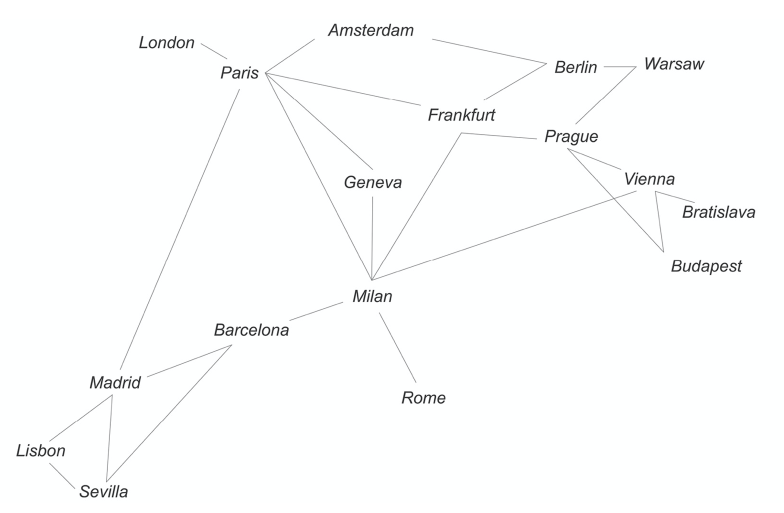
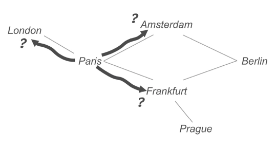
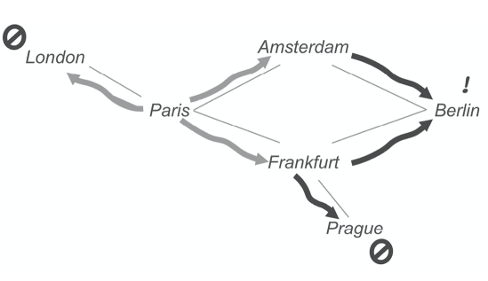

# Recursion

Let's get it out the way. The **doseq** macro is akin to the procedural **foreach** e.g. (noticing a return of **nil**)

```clojure
(doseq [n (range 3)]
  (println (str "Line " n)))
Line 0
Line 1
Line 2
=> nil
```

**doseq** doesn't collect anything - The sole purpose of **doseq** is to perform side effects.

There is a (fairly) standard naming conventions: *functions that produce side effects often have names that end with an exclamation point!

We can add more logic so say only print odd lines:

```clojure
(doseq [n (range 5)]
  (when (odd? n)
    (println (str "Line " n))))
Line 1
Line 3
=> nil
```

But if we are going to do this procedural stuff, at least use functional logic where possible e.g.

```clojure
(doseq [n (filter odd? (range 5))]
  (println (str "Line " n)))
Line 1
Line 3
=> nil
```

**Remember: shape the data, and then use the data.**

Let's move onto more functional approaches.

```clojure
(take 5 (repeat "Myself"))
=> ("Myself" "Myself" "Myself" "Myself" "Myself")
```

Initialise players in a game, where all players are represented as a Map:

```clojure
(zipmap [:score :hits :friends :level :energy :boost] (repeat 0))
=> {:score 0, :hits 0, :friends 0, :level 0, :energy 0, :boost 0}
```

The next step beyond **repeat** is the **repeatedly** function. Instead of taking a value, **repeatedly** takes a function and returns a lazy sequence of calls to that function. The function provided to **repeatedly** cannot take any arguments, which limits its usefulness to **impure functions**.

```clojure
(take 10 (repeatedly (partial rand-int 100)))
=> (80 69 14 9 47 86 98 56 6 37)
```

The next step beyond **repeatedly** is a function called **iterate**. Like **repeatedly**, **iterate** calls a function over and over again, returning the resulting lazy sequence. Unlike **repeatedly**, though, the function provided to **iterate** takes arguments, and the result of each call is passed on to the next iteration.

Let's say we have a bank account that returns an annual rate of 1% and we want to project what the balance will be each month for the next year:

```clojure
(defn savings [principal yearly-rate]
  (let [monthly-rate (+ 1 (/ yearly-rate 12))]
    (iterate (fn [p] (* p monthly-rate)) principal)))
=> #'clojure-backwards.chap3/savings

(take 13 (savings 1000 0.01))
=>
(1000
 1000.8333333333333
 1001.667361111111
 1002.5020839120368
 1003.3375023152968
 1004.1736169005594
 1005.0104282479765
 1005.847936938183
 1006.6861435522981
 1007.5250486719249
 1008.3646528791514
 1009.2049567565506
 1010.045960887181)
```

## Some Actual Recursive Functions

```clojure
(defn recursive-sum [so-far numbers]
  (if (first numbers)
    (recursive-sum (+ so-far (first numbers)) (next numbers))
    so-far))
=> #'clojure-backwards.chap3/recursive-sum

(recursive-sum 0 [300 25 8])
=> 333
```

## When to use *recur*

When running simple recursion you may get something like:

```clojure
(recursive-sum 0 (range 10000))
Execution error (StackOverflowError) at clojure-backwards.chap3/recursive-sum (form-init110507066.clj:3).
null
```

There is, however, a solution in Clojure, and it is called **recur**.

To use **recur**, we simply replace the call to **recursive-sum** with the **recur** in our original equation:

```clojure
(defn recursive-sum [so-far numbers]
  (if (first numbers)
    (recur (+ so-far (first numbers)) (next numbers))
    so-far))
=> #'clojure-backwards.chap3/recursive-sum

(recursive-sum 0 (range 10000))
=> 49995000
```

Why does this work? Well, with **recur**, a function becomes tail recursive. **Tail recursion** means that successive calls don't add to the call stack. Instead, the runtime treats them as repetitions of the current frame. You can think of this as a way of staying in the same frame rather than waiting for all the nested calls to resolve. In this way, the looping can continue without adding to the stack. This allows us to process large amounts of data without running into the dreaded stack overflow.

**A function can only be tail recursive if it returns a complete call to itself and nothing more.**

## Scope

Quick word on scope or accessibility:

*Clojure provides another mechanism for avoiding public functions. Functions defined with* **defn-** *instead of* **defn** *are only available inside the namespace where they are defined.*

## Identity

And a quick word on **identity**:

**identity**, is the Clojure function that simply returns whatever arguments it is provided with.

## Example

Let's solve a complex problem: finding the most efficient path through a network of nodes. Or, to put it differently: how to travel cheaply between European capitals. We have is a list of city-to-city connections and an amount in euros.

```clojure
(def routes
  [[:paris :london 236]
   [:paris :frankfurt 121]
   [:paris :milan 129]
   [:milan :rome 95]
   [:milan :barcelona 258]
   [:barcelona :madrid 141]
   [:madrid :lisbon 127]
   [:sevilla :lisbon 138]
   [:madrid :sevilla 76]
   [:barcelona :sevilla 203]
   [:madrid :paris 314]
   [:frankfurt :milan 204]
   [:frankfurt :berlin 170]
   [:frankfurt :geneva 180]
   [:geneva :paris 123]
   [:geneva :milan 85]
   [:frankfurt :prague 148]
   [:milan :vienna 79]
   [:vienna :prague 70]
   [:paris :amsterdam 139]
   [:amsterdam :berlin 176]
   [:amsterdam :frankfurt 140]
   [:vienna :bratislava 15]
   [:bratislava :prague 64]
   [:prague :warsaw 110]
   [:berlin :warsaw 52]
   [:vienna :budapest 43]
   [:prague :budapest 91]])
```



*In graph theory, each city would be called a node and the paths between cities would be called an edge.*

The goal is to write a function that takes two cities and returns a list of cities that represents the best route.

```clojure
; We'll build up a table (that can be queried) that looks like this:
{:paris {:london 236
         :frankfurt 121
         :milan 129
         ;;...etc...
         }}
```

```clojure
(defn grouped-routes [routes]
  (->> routes
       (group-by first)))
```

e.g.

```clojure
(:paris (grouped-routes routes))
=> [
     [:paris :london 236]
     [:paris :frankfurt 121]
     [:paris :milan 129]
     [:paris :amsterdam 139]
   ]
```

```clojure
(defn route-list->distance-map [route-list]
  (->> route-list
       (map (fn [[_ city cost]] [city cost]))
       (into {})))
```

e.g.

```clojure
(route-list->distance-map (:paris (grouped-routes routes)))
=> {:london 236, :frankfurt 121, :milan 129, :amsterdam 139}
```

We'll update function **grouped-routes** to use this new function **route-list->distance-map**:

```clojure
(defn grouped-routes [routes]
  (->> routes
       (group-by first)
       (map (fn [[k v]] [k (route-list->distance-map v)]))
       (into {})))
```

So the following result has changed:

```clojure
(:paris (grouped-routes routes))
=> {:london 236, :frankfurt 121, :milan 129, :amsterdam 139}
```

We still need to produce the reverse routes. We'll use **mapcat** to once again improve our **grouped-routes**:

```clojure
(defn grouped-routes [routes]
  (->> routes
       (mapcat (fn [[origin-city dest-city cost :as r]]
                    [r [dest-city origin-city cost]]))

       (group-by first)

       (map (fn [[k v]] [k (route-list->distance-map v)]))

       (into {})))
```

Remember that **mapcat** can be thought of as Scala's **flatMap** so even though, here, **mapcat** gives us something like:

```clojure
[[:paris :london 236] [:london :paris 236]]
```

this is flattened to:

```clojure
[:paris :london 236] [:london :paris 236]
```

giving us effectively twice as many routes, i.e. all original routes have been reversed.

```clojure
(def lookup (grouped-routes routes))
```

We'll ask for a route from Paris to Madrid:

```clojure
(get-in lookup [:paris :madrid])
=> 314
```

Can we go back to Paris?

```clojure
(get-in lookup [:madrid :paris])
=> 314
```

and check for a non-existing route:

```clojure
(get-in lookup [:paris :bratislava])
=> nil
```

**Pathfinding** - Say we want to get from Paris to Berlin.



The first step is to test the cities we can reach from Paris. In London, Amsterdam, and Frankfurt, we ask: are you Berlin?

Since none of the cities is the one that we are looking for, we repeat the process from London, Amsterdam, and Frankfurt:



We could represent these paths as Clojure vectors:

```clojure
[:paris :london nil]

[:paris :amsterdam :berlin]

[:paris :frankfurt :berlin]

[:paris :frankfurt :prague nil]
```

There is one more issue that we haven't dealt with yet. What prevents us from going from Amsterdam back to Paris? To get around this problem, we will need to "remember" where we've been.

Final solution:

```clojure
(defn find-path* [route-lookup destination path]
  (let [position (last path)]
    (cond
      (= position destination) path

      (get-in route-lookup [position destination]) (conj path destination)

      :otherwise-we-search (let [path-set (set path)
                                 from-here (remove path-set (keys (get route-lookup position)))]
                             (when-not (empty? from-here)
                               (->> from-here
                                    (map (fn [pos] (find-path* route-lookup destination (conj path pos))))
                                    (remove empty?)
                                    (mapcat (fn [x] (if (keyword? (first x)) [x] x)))))))))
```

```clojure
(defn cost-of-route [route-lookup route]
  (apply +
         (map (fn [start end] (get-in route-lookup [start end]))
              route (next route))))
```

```clojure
(cost-of-route lookup [:london :paris :amsterdam :berlin :warsaw])
=> 603
```

```clojure
(defn min-route [route-lookup routes]
  (reduce (fn [current-best route]
            (let [cost (cost-of-route route-lookup route)]
              (if (or (< cost (:cost current-best))
                      (= 0 (:cost current-best)))

                {:cost cost :best route}

                current-best)))

          {:cost 0 :best [(ffirst routes)]}

          routes))
```

Note that **ffirst** is equivalent to:

```clojure
(first (first x))
```

Finally:

```clojure
(defn find-path [route-lookup origin destination]
  (min-route route-lookup (find-path* route-lookup destination [origin])))

(find-path lookup :paris :rome)
=>
```

