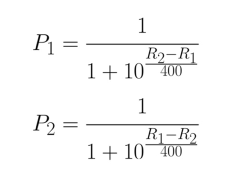
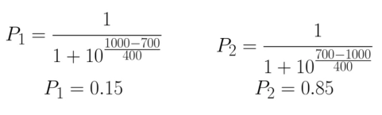
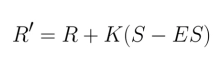

# Reducing i.e. Many to One

Example:

```clojure
(reduce (fn [sum-so-far item] (+ sum-so-far item)) [8 4000 10 30])
=> 4048

(reduce #(+ % %2) [8 4000 10 30])
=> 4048

(reduce + [8 4000 10 30])
=> 4048
```

We could do the following, but under the hood, reduce will be applied:

```clojure
(apply + [8 4000 10 30])
=> 4048
```

There is a second form of **reduce** that takes an additional argument. When the additional argument is present, it becomes the first argument to the reducing function. On that initial function call, the first item in the sequence is the second argument. This is a crucial improvement because the reducing function's return value no longer has to be the same kind of thing that is in the sequence.

Finds both the minimum and the maximum value in a sequence:

```clojure
(reduce (fn [{:keys [minimum maximum]} new-number]
          {:minimum (if (and minimum (> new-number minimum))
                      minimum
                      new-number)
           :maximum (if (and maximum (< new-number maximum))
                      maximum
                      new-number)})

        {} ;; Accumulator or initial value, in this case an empty Map

        [5 23 5004 845 22])
=> {:minimum 5, :maximum 5004}
```

## Partioning with Reduce

```clojure
(partition 3 [1 2 3 4 5 6 7 8 9 10])
=> ((1 2 3) (4 5 6) (7 8 9))

(partition-all 3 [1 2 3 4 5 6 7 8 9 10])
=> ((1 2 3) (4 5 6) (7 8 9) (10))

(partition-by #(> % 10) [5 33 18 0 23 2 9 4 3 99])
=> ((5) (33 18) (0) (23) (2 9 4 3) (99))
```

## Looking back with Reduce

We can **window** with **map** by using the input sequence more than once but have those duplicates offset giving multiple, windowed, parameters to **map**.

Let's "window" with reduce:

```clojure
(def numbers [4 9 2 3 7 9 5 2 6 1 4 6 2 3 3 6 1])
```

For each integer in the list, we want to return a two-item tuple containing:

- The integer itself
- If the integer is odd, the sum of the consecutive odd integers preceding it; if it's even, the sum of the consecutive even integers

Following this logic, the first **9** in the list should be replaced with **[9 0]**, since it is preceded by an even integer. The second **9**, on the other hand, should be replaced with **[9 10]**, since it is preceded by a **3**and a **7**.

```clojure
(defn parity-totals [ns]
  (:ret
    (reduce (fn [{:keys [current] :as acc} n]
              (if (and (seq current)
                       (or (and (odd? (last current)) (odd? n))
                           (and (even? (last current)) (even? n))))

                (-> acc
                    (update :ret conj [n (apply + current)])
                    (update :current conj n))

                (-> acc
                    (update :ret conj [n 0])
                    (assoc :current [n]))))

            {:current [] :ret []}

            ns)))

(parity-totals numbers)

=> [[4 0] [9 0] [2 0] [3 0] [7 3] [9 10] [5 19] [2 0] [6 2] [1 0] [4 0] [6 4] [2 10] [3 0] [3 3] [6 0] [1 0]]
```

The reducing function starts with some destructuring to give us easy access to **:current**; now, **n**, of course, is the current integer in the list. Inside the function, the structure is quite simple. The **if** expression has a somewhat elaborate set of nested logical operators. First, we use **(seq current)** to check whether **current** is empty, which would be the case on the first iteration. The **seq** function returns **false** if a vector or list is empty. Then, since we know **(last current)** will return an integer, we can test to see whether **n** and the previous value in the list are both odd or both even.

Depending on which branch of the **if** statement we end up in, we update **acc** differently. In the first case, the current integer has the same parity as the contents of **current**. We thread **acc** through two calls to **update**. As you remember from *Chapter 2*, *Data types and Immutability*, **update** takes a function as its second argument, **conj**in this case, because we are adding to the vector, and applies it to the value associated with the key provided as the first value. We add an additional argument, **[n (apply + current)]**. This will be the second argument to **conj**. Altogether, it's as though we were calling **conj** like this: **(conj (:ret acc) [n (apply + current)])**. The second call to **update** adds **n** to our running list of integers.

In the other case, when we are at the beginning of the list or because of a change from odd to even or even to odd, we know that the current total is zero. Instead of **update**, we can use **assoc** here because we're starting over with a fresh list.

## Reducing without Reduce

Clojure's **zipmap** function is a tool for building a map from two sequences. The first sequence becomes the keys for the new map and the second becomes the values.

```clojure
(zipmap [:a :b :c] [0 1 2])
=> {:a 0, :b 1, :c 2}
```

## Maps to Sequences and Back Again

```clojure
(into {} [[:a 1] [:b 2]])
=> {:a 1, :b 2}
```

And vice versa:

```clojure
(seq {:a 1 :b 2})
=> ([:a 1] [:b 2])
```

```clojure
(def letters-and-numbers {:a 5 :b 18 :c 35})
=> #'clojure-backwards.chap3/letters-and-numbers

(into {} (map (fn [[k v]] [k (* v 10)]) letters-and-numbers))
=> {:a 50, :b 180, :c 350}
```

The **group-by** function takes a sequence, calls a function on each item, and uses whatever the function call returns as a key in a map. The value of the key will be a list of all the items that returned the same key.

```clojure
(def dishes [{
  :name "Carrot Cake"
  :course :dessert
} {
  :name "French Fries"
  :course :main
} {
  :name "Celery"
  :course :appetizer
} {
  :name "Salmon"
  :course :main
} {
  :name "Rice"
  :course :main
} {
  :name "Ice Cream"
  :course :dessert
}])

(group-by :course dishes)
=>
{:dessert [{:name "Carrot Cake", :course :dessert} {:name "Ice Cream", :course :dessert}],
 :main [{:name "French Fries", :course :main} {:name "Salmon", :course :main} {:name "Rice", :course :main}],
 :appetizer [{:name "Celery", :course :appetizer}]}
```

Under the hood, **group-by** uses **reduce** - we could try to write our own, also using **reduce** e.g.

```clojure
(defn our-group-by [f xs]
  (reduce (fn [acc x]
            (update acc (f x) (fn [sublist] (conj (or sublist []) x))))
          {}
          xs))
```

and again:

```clojure
(our-group-by :course dishes)
=>
{:dessert [{:name "Carrot Cake", :course :dessert} {:name "Ice Cream", :course :dessert}],
 :main [{:name "French Fries", :course :main} {:name "Salmon", :course :main} {:name "Rice", :course :main}],
 :appetizer [{:name "Celery", :course :appetizer}]}
```

## An Exercise

Suppose that for each tennis player, we need to know the number of matches played, won, and lost. We'll walk through two different ways to solve the problem in Clojure (reading a CSV file of matches).

The first using reduce and the second using group-by, one of Clojure's many convenient reduce-based functions.

NOTE - We will not have to call **doall** since **reduce** is not lazy.

Example data:

tourney_year_id,tourney_order,tourney_slug,tourney_url_suffix,tourney_round_name,round_order,match_order,winner_name,winner_player_id,winner_slug,loser_name,loser_player_id,loser_slug,winner_seed,loser_seed,match_score_tiebreaks,winner_sets_won,loser_sets_won,winner_games_won,loser_games_won,winner_tiebreaks_won,loser_tiebreaks_won,match_id,match_stats_url_suffix

1968-580,1,australian-open,/en/scores/archive/australian-open/580/1968/results,Finals,1,1,Bill Bowrey,b224,bill-bowrey,Juan Gisbert Sr,g076,juan-gisbert-sr,1,2,75 26 97 64,3,1,24,22,0,0,1968-580-b224-g076,

Another note regarding **update-in** (as it can be confusing):

(update-in m ks f & args)

Updates a value in a nested associative structure, where **ks** is a sequence of keys and **f** is a function that will take the old value and any supplied args and return the new value, and returns a new nested structure. If any levels do not exist, hash-maps will be created.

```clojure
(defn win-loss-by-player [csv]
  (with-open [r (io/reader csv)]
    (->> (csv/read-csv r)
         sc/mappify

         (reduce (fn [acc {:keys [winner_slug loser_slug]}]
                   (-> acc
                       (update-in [winner_slug :wins]
                                  (fn [wins] (inc (or wins 0))))

                       (update-in [loser_slug :losses]
                                  (fn [losses] (inc (or losses 0))))))

                 {} ; an empty map as an accumulator
                 ))))

; E.g. updating acc for "Roger Federer":
; (update-in acc ["roger-federer" :wins] (fn [wins] (inc (or wins 0))))

(def w-l (win-loss-by-player "match_scores_1991-2016_unindexed_csv.csv"))

(get w-l "roger-federer")
=> {:losses 240, :wins 1050}
```

*We need to use* **get** *here because the keys in our map are strings. If we had used the* **keyword** *function to convert the player "slugs" when building up the map, we could access a player's data with* **(:roger-federer w-l)** *instead.*

## Rating System

The **ELO** rating system can be used for say any sport - we'll use it for tennis. The formula is:



*P*1 and *P*2 here are the probabilities of winning for player one and player two. *R*1 and *R*2 are their respective ratings before the match.

Example: If we fill in the values for a match between a player, rated at 700, and a stronger player, rated at 1,000, we get the following results:



The *P*1 value indicates that there is a 15% chance that the weaker player will win the match and an 85% chance that the stronger player will win. 

```clojure
; A function implementing the formula for calculating the probability of a player defeating another player:
(defn match-probability
  [player-1-rating player-2-rating]
  (/ 1
     (+ 1
        (math/expt 10 (/ (- player-2-rating player-1-rating) 400)))))

(match-probability 700 1000)
=> 0.15097955721132328

(match-probability 1000 700)
=> 0.8490204427886767
```

This equation shows how the player's score is updated after a match:



A player's new rating (*R'*) is based on their previous rating (*R*), the match score (*S*), the expected score (*ES*), and the *K* factor.

The score (*S*) of a tennis match is either 0, for a loss, or 1, for a victory. If a player is expected to win by a probability of 0.75 and they go on to win their match, then the (*S* - *ES*) part of the equation works out to 1 - 0.75 = 0.25. This result gets multiplied by what the Elo system calls the "*K* factor." The *K* factor determines the impact of a match result on a player's overall rating. A high *K* factor means ratings will move around a lot; a low *K* factor means they will be more stable. If we use a *K* factor of 32, that gives us 32 * 0.25 = 8, so the player's rating in this example would go up by eight points. If the player had lost instead, we would get 32 * (0 - 0.75) = -24. Once again, unexpected results thus have a much greater impact on ratings.

```clojure
; A k-factor var and a function that encapsulates the equation for updating a player's rating after a match:
(def k-factor 32)

(defn recalculate-rating [previous-rating expected-outcome real-outcome]
  (+ previous-rating (* k-factor (- real-outcome expected-outcome))))
```

```clojure
; Calculate new rating when player rated at 1500 loses to player rated 1400
(recalculate-rating 1500 (match-probability 1500 1400) 0) ; 0 as in the player being recalcuated lost
=> 1479.5179200063076
```

